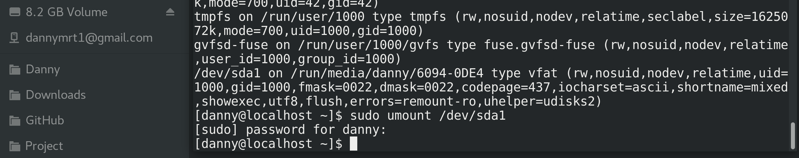

            
            
<h1>
Basic Linux Commands
</h1>
            
            

## man(manual)
A program that shows the manuals of every basic command.

Screenshot of `man man`

 

## info(information)
Detailed version of `man`.

Screenshot of `info info`

>If you want to see mere syntax, use `man` instead.

## dnf
Fedora's package manager. It is namely `apt-get` for Ubuntu.

Installing new packages or modifying installed ones requires administrative privileges.
But, searching for packages in enabled repositories doesn't.
Hence, `dnf upgrade` and `dnf install <package-name>` are invalid. And `dnf search <package-name>` is good to go.

**The `update` option is currently an alias of the `upgrade` option. It may be taken out someday.**

Screenshot of `sudo dnf upgrade`

 

## ls(list)
Lists directories and files under a chosen path. It will list the items under the current path if no path specified.

Screenshot of `ls -la /`

  

## mv(move)
Moves items from one place to another. It is also used to rename items.

Screenshot of `mv <from> <to>` (an example of renaming items)

   

## chmod(change mode)
Changes users' privileges about items.

Screenshot of `chmod <mode> files...` (an example of renaming items)

Did you find anything strange?

The privileges aren't changed at all!

Well, that's because the files are on an **NTFS** drive.

Linux operating systems can't handle NTFS very well.

     

## chown
Changes the ownership of items.

Screenshot of `chown <owner> files...`

## chgrp
Changes the group the item belongs to.

Screenshot of `chgrp <group> files...`

## ln
Creats links for files.

Screenshot of `ln <options> original_file link_name`

>**Hard links vs soft(symbolic) links**
>
>Hard links link directly to the contents of the entry.
>
>Soft links link to the entry.

## tar
The compress and decompress program for Linux systems.

Screenshot of `tar` compression and decompression with lzop.

   

## vim
Improved version of vi.

file creation/modification: `vim <filename>`

Interactive mode:

*   insert: `Esc`->`i`
*   quit without change: `Esc`->`:!q`
*   write and quit: `Esc`->`:wq`

Screenshot of vim usage.

     

## gcc
GNU Compiler Collecion.
What is GNU?
It stands for "GNU's Not Unix".
So what does GNU actually means?
"G(G(G(G(G(G(G(G(G(G(G(G(G(G..."--Recursive--

Screenshot of compiling C code with some parameters.

  

## mount

Mounts drives.

Screenshot of `mount -l` and `sudo umount <path>`.

Screenshot of `mount <path> <destination>`.

